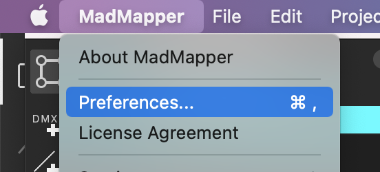
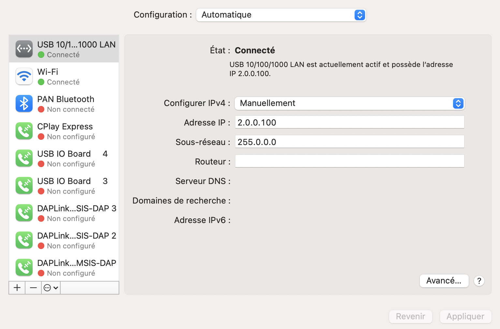
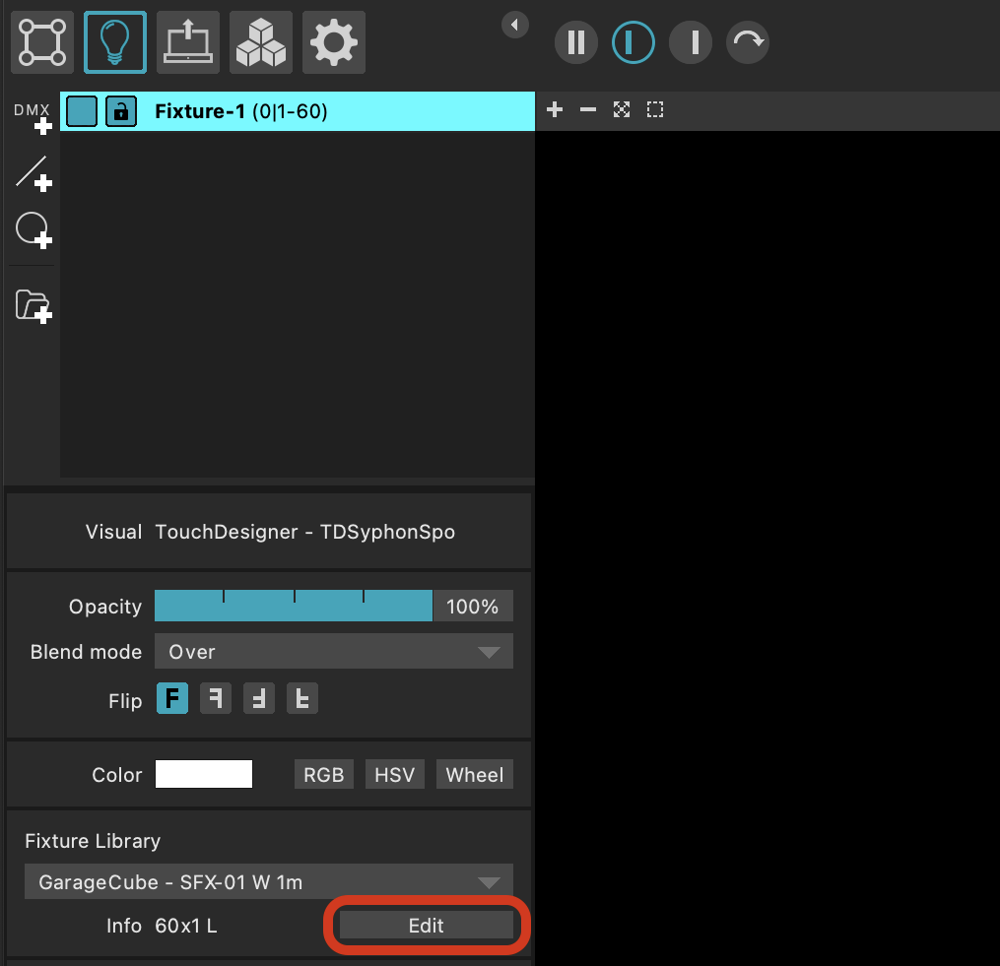
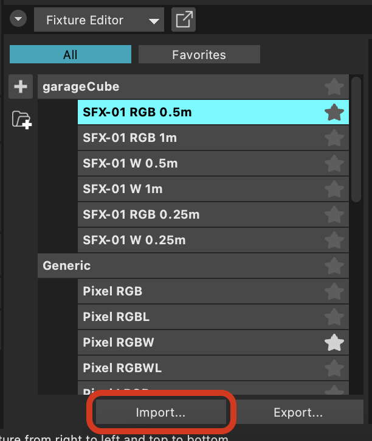
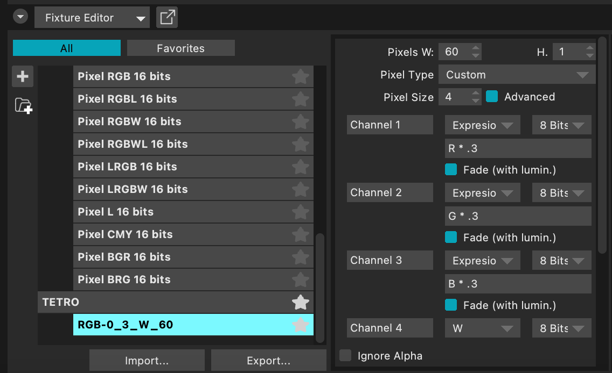
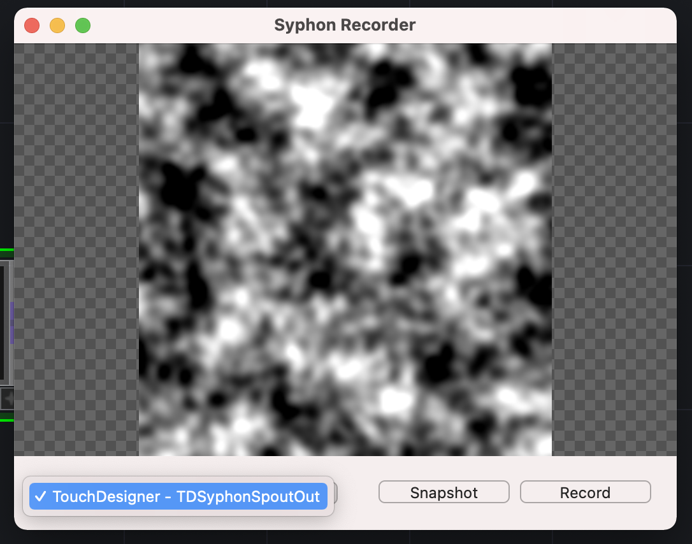
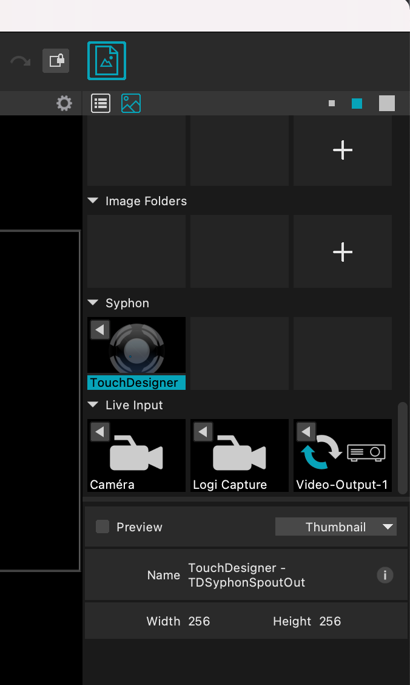

# Madmapper_PixelMapping

Préface : 
c'est mieux de maîtriser un peu MadMapper ou au moins d'avoir lu le tuto [MadMapper_2spi](https://github.com/LucieMrc/Madmapper_2spi).

**Ou comment sortir un visuel sur des barres LED en pixel mapping.**

Pré-requis :
- Avoir des barres LED controlâbles en DMX + un boîtier DMX-USB, ou être à l'atelier avec les boîtiers Artnet.

## Introduction - point technique

### Le pixel mapping

Pixel mapping c'est quoi

### Le DMX et l'adressage
On controle la lumière en DMX, une norme de transmission de données qui permet de contrôler 512 canaux avec des valeurs de 0 à 255. On appelle univers DMX une ligne de 512 canaux, et on peux parfois contrôler plusieurs univers simultanément pour contrôler plusieurs lignes de 512 canaux.

On branche les projecteurs en série avec des câbles DMX et on les adresse en fonction du nombre de canaux qu'ils utilisent.

Par exemple, si on branche deux projecteurs RGB utilisant 3 canaux chacun (R, G et B) en série, on pourra adresser le premier projecteur en 1 et le second en 4. On utilise ainsi 6 canaux :
- 1 : R premier projecteur
- 2 : G premier projecteur
- 3 : B premier projecteur
- 4 : R second projecteur
- 5 : G second projecteur
- 6 : B second projecteur

On peux ensuite brancher d'autres projecteurs en série en continuant l'adressage selon le nombre de canaux utilisés par chaque projecteur.

### L'Artnet

Le protocole Artnet permet de travailler 

## 1. Avec boîter DMX

### Branchements DMX

Choisir l'adresse

Tout brancher

Boitier DMX USB

### Mise en place dans Madmapper

Ouvrir les Préférences en cliquant sur MadMapper > Preferences... et aller dans l'onglet DMX Output.

Choisir le boîtier DMX-USB, ici `EnttecPro Out`.

Aller dans l'onglet Fixtures et créer une nouvelle fixture DMX en cliquant sur le bouton `DMX +`.

Choisir le channel d'adresse de la light.

## 2. En Artnet

### Branchements et mise en réseau

Avec nos boîtiers + un modem + le tout relié en câbles ethernets à l'ordinateur.

Couper la wifi de l'ordinateur pour être uniquement sur le réseau ethernet.

Changer l'adresse IP en 2.0.0.100 et le masque en 255.0.0.0. 
Sous mac, dans les paramètres réseaux:

### Mise en place dans Madmapper

Aller dans les préférences MadMapper, dans l'onglet DMX Output.

Pour `DMX Output Device` choisir `Artnet`, et pour `Interface` choisir `Ethernet - 2.0.0.100`.

En cochant `Use Unicast`, les fixtures detectées devraient apparaître : ici LED CTRL 2.

### Créer les fixtures

Aller dans l'onglet Fixtures et créer une nouvelle fixture DMX en cliquant sur le bouton `DMX +`.

Pour les barres de LED de l'atelier, télécharger le fichier `fixture1m.mmfl` ou `fixture_2m.mmfl` en fonction de la taille des barres.

Dans les paramètres de la fixture, on peux ensuite cliquer sur `Edit` dans la partie Fixture Library.

On ouvre ainsi le menu `Fixture Editor`, avec une liste de fixtures pré-définies. 
En cliquant sur `Import...`, on peux importer les modèles de fixtures téléchargées.

## 3. Communication

Pour envoyer de la vidéo en temps réel depuis TouchDesigner par exemple, on utilise [Spout](https://spout.zeal.co) (sous windows) ou [Syphon](http://syphon.v002.info) (sous mac).
Spout/Syphon permet d'envoyer de la vidéo en temps réel d'un logiciel à un autre. 

Pour faire TouchDesigner -> Syphon -> MadMapper, il faut tout d'abord créer un node `Syphon Spout Out` et le placer en sortie de ce qu'on veux envoyer.

On ouvre ensuite Syphon Recorder, qui détecte directement la sortie vidéo de TouchDesigner.

Dans MadMapper, dans l'onglet des textures, une catégorie Syphon apparaît automatiquement et permet de sélectionner la sortie de TouchDesigner.

## Fin

## Pour aller + loin

Le tuto [MadMapper_OSC](https://github.com/LucieMrc/MadMapper_OSC) pour contrôler des paramètres de MadMapper avec des valeurs envoyés en OSC depuis un téléphone.

Le tuto [utilisation du Spatial Scanner](https://github.com/LucieMrc/MadMapper-SpatialScanner-Tuto) pour scanner rapidement des scènes et en sortir une image correspondant à ce que "voit" le projecteur.