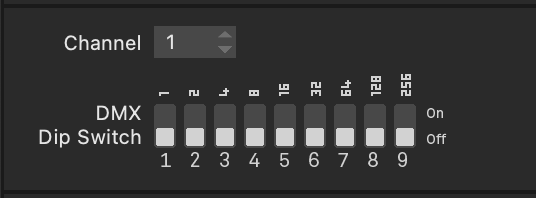
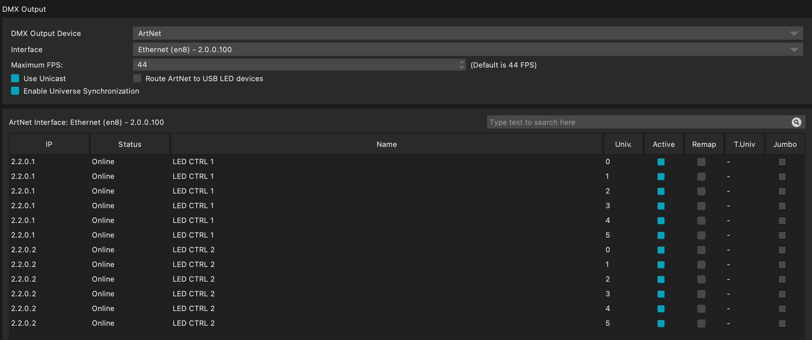

# Madmapper_LedMapping

Préface : 
c'est mieux de maîtriser un peu MadMapper ou au moins d'avoir lu le tuto [MadMapper_2spi](https://github.com/LucieMrc/Madmapper_2spi).

**Ou comment sortir un visuel sur des barres LED en pixel mapping.**

Pré-requis :
- Avoir des barres LED controlâbles en DMX + un boîtier DMX-USB, ou être à l'atelier avec les boîtiers Artnet.

## Avec boîter DMX

### Branchements DMX

Choisir l'adresse

tout brancher

Boitier DMX USB

### Mise en place dans Madmapper

Ouvrir les Préférences en cliquant sur MadMapper > Preferences... et aller dans l'onglet DMX Output.

Choisir le boîtier DMX-USB, ici `EnttecPro Out`.

Aller dans l'onglet Fixtures et créer une nouvelle fixture DMX en cliquant sur le bouton `DMX +`.

Choisir le channel d'adresse de la light.

## En Artnet

### Branchements et mise en réseau

Avec nos boîtiers + un modem + le tout relié en câbles ethernets à l'ordinateur.

Couper la wifi pour être uniquement sur le réseau ethernet.

Changer l'adresse IP en 2.0.0.100 et le masque en 255.0.0.0. 
Sous mac, dans les paramètres réseaux:

### Mise en place dans Madmapper

Aller dans les préférences MadMapper, dans l'onglet DMX Output.

Pour `DMX Output Device` choisir `Artnet`, et pour `Interface` choisir `Ethernet - 2.0.0.100`.

En cochant `Use Unicast`, les fixtures detectées devraient apparaître : ici LED CTRL 2.

## Communication

spout syphon : node td, pannel, detecté dans madmapper

## Fin

## Pour aller + loin

Le tuto [MadMapper_OSC](https://github.com/LucieMrc/MadMapper_OSC) pour contrôler des paramètres de MadMapper avec des valeurs envoyés en OSC depuis un téléphone.

Le tuto [utilisation du Spatial Scanner](https://github.com/LucieMrc/MadMapper-SpatialScanner-Tuto) pour scanner rapidement des scènes et en sortir une image correspondant à ce que "voit" le projecteur.